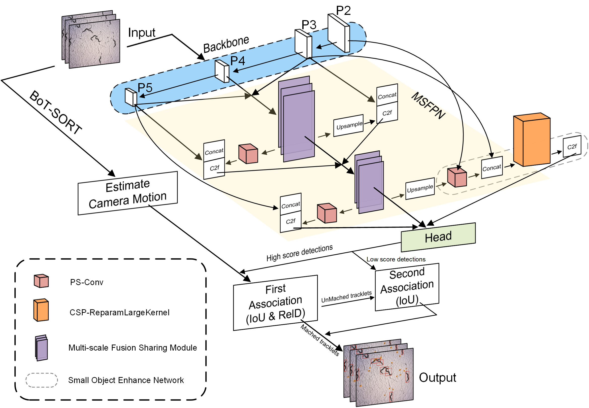

<h1 align="center">🎯 WormReIDTracker: A C. elegans Tracking Framework Based on Cross-Scale Feature Fusion and Identity Feature Regression</h1>

## 🏡 About

This repository hosts the official implementation of a novel framework dedicated to robust nematode tracking. It features two key modules, MFSM and SOEN, designed to fuse multi-scale features for improved bounding box precision. By leveraging an identity feature regression module, the framework effectively reduces identity switching for more stable tracking.  Included are training/evaluation <a href="https://github.com/1490560350/WormReIDTracker">codes</a>, and <a href="https://zenodo.org/records/19871295">results</a>.

## 📂 Datasets
Dataset[^1]: Consists of over 1500 images of size 1024x1024, covering various developmental stages from larvae (L1-L4) to adults. The images were captured under uneven lighting conditions and collected with magnifications of 1.5x, 2x, and 5x. The training set accounts for 90%, and the test set for 10%. Consists of a worm re-identification dataset with 32 different identities. Each identity contains between dozens to 300 images, totaling approximately 9000 images, with each image being 100x150 in size. The training set includes 28 identities, the test set includes 4 identities, and the query set also includes 4 identities. Includes five different videos of freely moving C. elegans, covering scenarios with both single and multiple worms. The videos vary in background, microscope magnification, and the developmental stages of the worms. <a href="https://drive.google.com/drive/folders/1PM4Rvrz-V6p-xqAEWsz66tAKu4W5x8Mc">Dataset Access</a>.

Dataset[^2]: Contains over 400 images of C. elegans, divided into two categories: GFP and WT, covering a range of sizes and environmental conditions. The training set accounts for 90%, and the test set for 10%. <a href="https://zenodo.org/record/7714497">Dataset Access</a>.

Dataset[^3]: Comprises over 1100 images of C. elegans with sizes of 3280x2464 and 1640x1232, covering different developmental stages. The training set accounts for 90%, and the test set for 10%. Contains over 100 images of size 1280x1024, each containing both worms and eggs, annotated into two categories. The training set accounts for 90%, and the test set for 10%. <a href="https://figshare.com/articles/figure/Deep_learning_for_robust_and_flexible_tracking_in_behavioral_tracking_for_C_elegans_-_Supplementary_Material/13681675">Dataset Access</a>.

Dataset[^4]: This dataset is from the C. elegans behavioral phenotype database and contains worm videos from multiple strains. We annotated three of these videos, totaling approximately 200 images, which include two categories: worms and eggs. The training set accounts for 70%, and the test set for 30%. <a href="https://www.youtube.com/@wormbehavior">Dataset Access</a>.

Dataset[^5]: Contains videos of free-moving tph-1 and N2 strain worms, recording their movement behavior in Petri dishes with and without food.

## 🔧 Setup 
- ###  WormReIDTracker
1. Clone the repository:
   `git clone https://github.com/1490560350/WormReIDTracker.git`  # Clone the WormReIDTracker repository.

2. Setup environments:

   `cd WormReIDTracker`  # Navigate to the WormReIDTracker directory.
   
   `conda create -n wormreidtracker`  # Create a Conda environment named wormreidtracker.
   
   `pip install -e .`  # Install WormReIDTracker in editable mode.

4. Running the tracker after cloning the WormReIDTracker repository:
   
   `python train.py`  # Run the training script; you can configure the dataset and whether to load pre-trained weights in the train.py file.     Note: It is necessary to modify the actual path of the dataset in the `WormReIDTracker/ultralytics/cfg/datasets/data.yaml` file.
   
   `python track_BotSort.py`  # Run the tracking script.

WormReIDTracker is based on the YOLO model. For more details, please visit: https://github.com/ultralytics/ultralytics. 

- ###  FastReID
   `cd WormReIDTracker/FastReID`  # Navigate to the FastReID directory.

   `conda create -n fastreid python=3.7` # Create a Conda environment named fastreid.

   `conda activate fastreid` # Activate the Conda environment named fastreid.

  `pip install -r docs/requirements.txt` # Install all dependencies.

  `python tools/train_net.py --config-file ./configs/Worm/mgn_R50-ibn.yml MODEL.WEIGHTS ./weights/market_mgn_R50-ibn.pth MODEL.DEVICE "cuda:0"`

For the FastReID code and usage instructions, please visit please visit: https://github.com/JDAI-CV/fast-reid.
- ###  TrackEval
  `python scripts/run_mot_challenge.py --BENCHMARK worm --TRACKERS_TO_EVAL BotSort --METRICS HOTA CLEAR Identity VACE --USE_PARALLEL False --NUM_PARALLEL_CORES 8` #

For the TrackEval code and usage instructions, please visit: https://github.com/JonathonLuiten/TrackEval.

## 📝 References
[^1]: Banerjee SC, Khan KA, Sharma R. Deep-worm-tracker: Deep learning methods for accurate detection and tracking for behavioral studies in C. elegans. Applied Animal Behaviour Science. 2023;266:106024.

[^2]: Zhang J, Liu S, Yuan H, Yong R, Duan S, Li Y, et al. Deep learning for microfluidic-assisted Caenorhabditis elegans multi-parameter identification using YOLOv7. Micromachines. 2023;14(7):1339.

[^3]: Bates K, Le KN, Lu H. Deep learning for robust and flexible tracking in behavioral studies for C. elegans. PLOS Computational Biology. 2022;18(4):e1009942.
   
[^4]: Yemini E, Jucikas T, Grundy LJ, Brown AE, Schafer WR. A database of C. elegans behavioral phenotypes. Nature Methods. 2013;10(9):877.

[^5]: Moy K, Li W, Tran HP, Simonis V, Story E, Brandon C, et al. Computational methods for tracking, quantitative assessment, and visualization of C. elegans locomotory behavior. PloS one. 2015;10(12):e0145870.

